# **Panduan Git**

## **Perjanjian Baru**

### **Daftar Isi**

1. [Apa itu repository](#repository)
1. [Apa itu branch](#branch)
1. [Cara menjalankan aplikasi](#cara-run-aplikasi)
1. [Cara push kerjaan kita ke repository](#cara-push-kerjaan-kita-dari-local-ke-branch-kita-di-repository)
1. [Cara merge kerjaan ke branch utama](#cara-merge-kerjaan-kita-ke-branch-utama)
1. [Kesimpulan](#kesimpulan)
1. [Daftar pustaka](#daftar-pustaka)

### **Repository**

Merupakan adalah tempat kita simpan kerjaan kita secara online. Repository ini(biasa disingkat repo) ini dapat dikerjakan secara bersamaan oleh banyak developer, tapi, kalo kita kerjain semua nya di tempat yang sama, bakalan tabrakan. Maka dari itu, ada sebuah fitur yang bernama **branch**. 

Namun, sebelum kita mulai mengerjakan, mari kita clone dulu repository yang sudah dibuat, ke pc kita masing-masing. Lalu, bagaimana [cara clone repository](#cara-clone-repository)?

Kembali ke [daftar isi](#daftar-isi)

### **Cara clone repository**

Simple aja, buat directory dimana kita ingin clone repository kita itu. Jangan buat directory di locak disk C ya, buat di local disk D. Dari claimq, rule naming nama folder tempat repository ingin di clone adalah
```
[nama-developer-migrasi] 
contoh : john-doe-migrasi
```
Lalu, kita [buka directory](#cara-membuka-directory) tempat kita itu dari 
`git bash` di aplikasi visual studio code.

setelah directory kita terbuka, maka kita jalankan command 
```
git clone <link repo git kita>
```

### **Branch**
Untuk contoh, saya ambil untuk contoh ClaimQ, kami, punya branch dev, dimana codingan utama disimpan. Dari branch dev ini nantilah, kami masing2 developer buat branch sendiri, yang meng-copy dari branch dev ini. Lalu, developer A, mendapatkan tugas untuk mengerjakan fitur dashboard testing. Apa yang perlu dilakukan developer A?

<ol>
<li>Membuat branch baru dengan nama <code>feat/dashboard-testing</code>.
Kenapa feat/dashboard-testing? karena, kami tim ClaimQ telah menyetujui rule naming branch ini. Feat itu adalah singkatan dari feature. Nantinya, akan ada rule naming lain yang ada peraturannya, namun, karna ini migrasi, kita anggap saja semua itu adalah fitur ya. Bagaimana <a href="#cara-membuat-branch-baru">cara membuat branch baru</a> ?
<li>Lalu, setelah developer A mengerjakan semua fiturnya, maka Ia harus <a href="#cara-push-kerjaan-kita-dari-local-ke-branch-kita-di-repository">push kerjaan</a> dia ke branch dia sendiri.</li>
<li>Melakukan merge dari branch utama(dalam case ini dev) ke <a href="#cara-merge-kerjaan-kita-ke-branch-utama">branch dia sendiri,</a>  namun, untuk pencegahan error, disarankan membuat satu <a href="#cara-membuat-branch-baru"></a>branch backup.
</li>
<li>Melakukan testing di branch backup nya sendiri setelah melakukan merge dengan branch utama.</li>
<li>Setelah aman, maka developer A wajib menginfokan ke pic merging agar dapat merge branch backup ke branch master.</li>
</ol>

Kembali ke [daftar isi](#daftar-isi)

### **Cara membuat branch baru**

Kita buka branch utama kita, di contoh ini, itu adalah branch `dev`. Maka, branch yang terbuka di terminal git bash kita adalah branch `dev`.

Pastikan anda telah di directory yang benar ya. Maksudnya directory yang benar itu apa? Coba kita buka repo di github webnya.

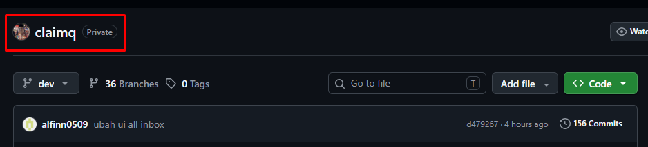

Yang ditandai merah, itu adalah directory terluar kita. Lalu, coba kita check directory yang terbuka pada vs-code kita.

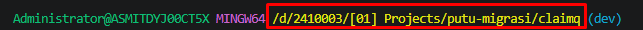

Jika directory yang kita buka sudah sama dengan yang ada di directory terluar di repo git web, maka kita sudah berada di jalan yang benar.

Setelah kita berada di directory yang benar, kita juga harus memastikan kita berada di branch yang benar.
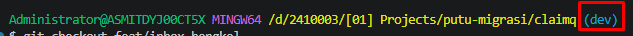

Yang ditandai merah adalah tanda branch yang sedang kita buka. Di case ini, branch yang sedang dibuka adalah branch `dev`, dan branch baru yang ingin dibuat memang ingin dicopy dari branch `dev` karna di case ini, branch dev menjadi acuan utama.

Sekarang, kita perlu mengetikkan command di terminal git bash kita, dengan command
```
git checkout -b feat/dashboard-testing
```
Jangan lupa, rule naming penamaan branch harus disepakati di awal ya.

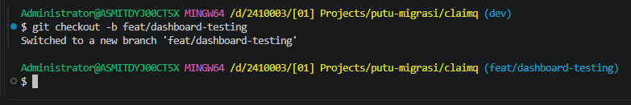

Setelah branch berhasil dibuat, maka akan muncul pesan seperti diatas, dan nama branch yang sedang dibuka sudah berubah. Selamat, anda telah berhasil membuat branch baru. Langkah selanjutnya, kita akan mempelajari [cara run aplikasi](#cara-run-aplikasi) di pc kita masing-masing

Kembali ke [daftar isi](#daftar-isi)

### **Cara menjalankan aplikasi**

Untuk run aplikasi, kita harus dan [menjalankan backend](#menjalankan-back-end) dan [frontend](#menjalankan-front-end) aplikasi kita.

#### **Menjalankan Back End**

Untuk menjalankan back end, kita harus membuka directory back end aplikasi kita sendiri. List langkahnya adalah : 

<ol>
<li>
<a href="#cara-membuka-terminal-baru">Membuka terminal</a> git-bash baru pada vs-code
</li>
<li><a href="#cara-membuka-directory">Membuka directory</a> backend aplikasi kita. Directory backend masing2 tim berbeda, untuk contoh case ini, saya contohkan membuka directory backend claimq</li>

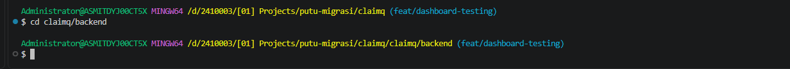


<li>Setelah berhasil masuk directory, maka kita perlu menjalankan command <pre><code>CLAIMQ_ENV=DEV go run ./cmd/claimq</code></pre></li>
<li>Jika berhasil, maka akan muncul seperti gambar dibawah ini</li>

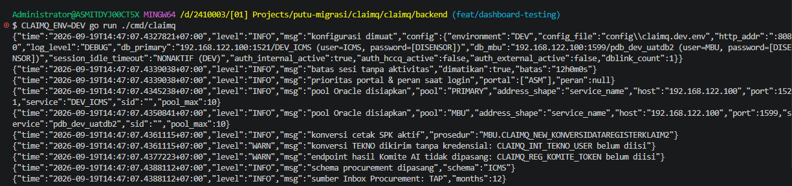
<li>Jika muncul pesan bahwa ada port backend lain yang sedang berjalan, maka silahkan <a href="#cara-matikan-paksa-terminal-backend">matikan paksa terminal backend</a></li>
</ol>

Kembali ke [daftar isi](#daftar-isi)

#### **Menjalankan Front End**

<ol>
<li>
<a href="#cara-membuka-terminal-baru">Membuka terminal</a> git-bash baru pada vs-code
</li>
<li><a href="#cara-membuka-directory">Membuka directory</a> frontend aplikasi kita. Directory frontend masing2 tim berbeda, untuk contoh case ini, saya contohkan membuka directory frontend claimq</li>

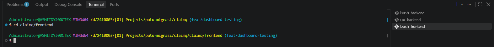
<li>Saat pertama kali kita ingin menjalankan front end, maka kita harus install dependencies front end terlebih dahulu dengan command <code>npm install</code> pada directory front end kita. Jika npm install berhasil, maka akan muncul tampilan seperti dibawah ini.</li>

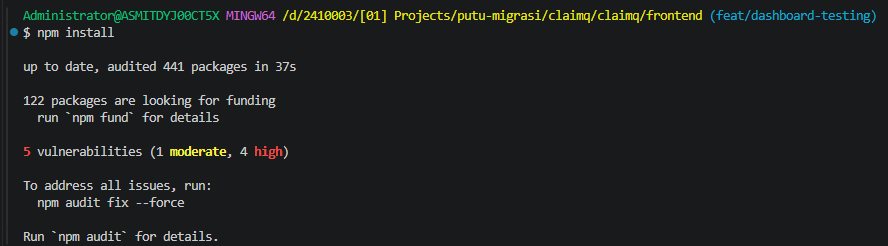
Perlu diingat bahwa npm install ini hanya perlu dijalankan ketika awal clone, dan jika ada dependencies baru yang ditambahkan pada aplikasi kita.
<li>Setelah berhasil install, maka kita perlu menjalankan command <code>npm run dev</code>. 
Jika sukses maka akan muncul tampilan seperti berikut :

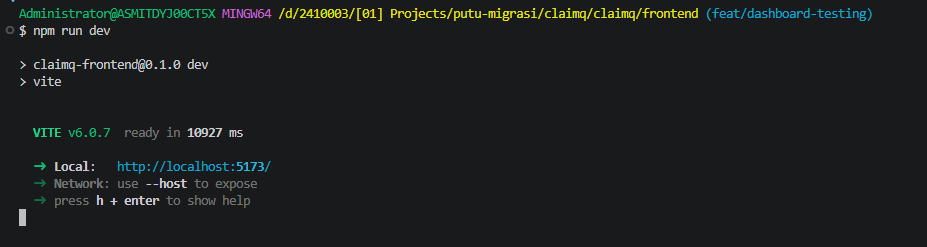

Link local yang muncul pada terminal adalah link frontend aplikasi pada pc kita.

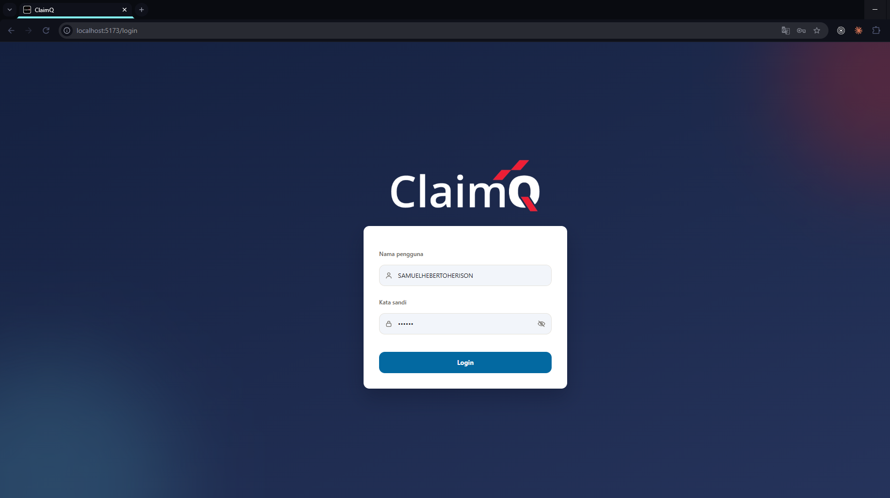
</li>
</ol>

Kembali ke [daftar isi](#daftar-isi)

### **Cara merge branch**

Cara kita gabungkan kerjaan kita dari branch masing-masing ke branch utama(dalam contoh case ini, adalah branch dev), adalah dengan cara berikut : 
<ol>
<li>Pertama-tama, [kita harus memastikan](#cara-memastikan-kerjaan-sudah-di-push) bahwa kerjaan kita sudah kita push ke branch kita sendiri.</li>
</ol>

Kembali ke [daftar isi](#daftar-isi)

## **Daftar Pustaka**

#### **Cara merge kerjaan kita ke branch utama**

<ol>
<li>Yang pertama, kita harus memastikan kerjaan di local kita sudah <a href="#cara-push-kerjaan-kita-dari-local-ke-branch-kita-di-repository">ter-push</a> dengan baik di branch repo</li>
<li>Jika sudah, mari kita pindah branch ke branch utama kita, dalam case ini, branch dev. Kita jalankan dengan command <pre><code>git checkout [nama branch yang dituju]</code></pre>

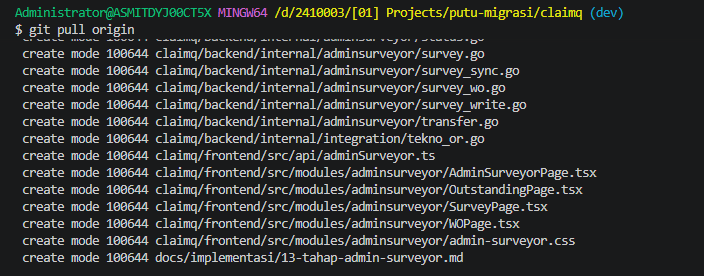

Jika berhasil, maka nama branch yang muncul pun akan berubah sesuai dengan nama branch yang kita tuju.
</li>
<li>Setelah berhasil pindah branch, kita perlu ambil file terbaru dari branch utama yang ada di repo kita(karna siapa tau sudah ada fitur baru di branch utama kita berkerja), kita perlu menjalankan command <pre><code>git pull origin</code></pre></li>

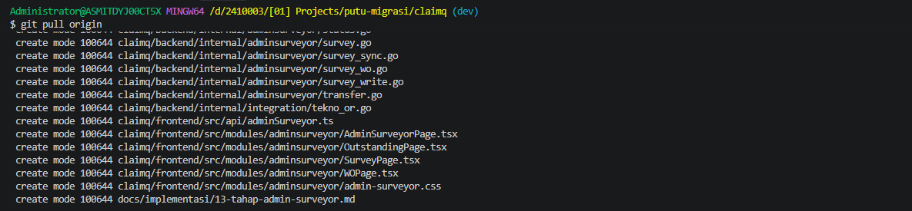

Ini , contoh kalau ada fitur baru di branch dev. 
<li>Setelah berhasil git pull origin, kita perlu pindah lagi ke branch yang ingin kita tambahkan fitur nya ke branch utama. Kenapa perlu bolak-balik? Ini murni hanya pencegahan kami agar branch utama, itu selalu aman dari error setelah merge, jadi cara yang dilakukan adalah, menggabungkan branch utama, ke branch yang ingin kita tambahkan fiturnya(dalam hal ini, fitur dashboard-testing), namun ada pencegahan lagi yang perlu dilakukan yaitu dengan membuat branch backup baru dari branch yang ingin kita gabungkan ke branch utama. Biasanya, nama branch backup nya kami tambahkan -backup dibelakang nama branch asli, contohnya adalah <code>feat/dashboard-testing-backup</code></li>.Perlu diingat bahwa branch bakcup harus merupakan copyan dari branch yang ingin kita tambahkan fiturnya. Dalam case ini, branch <code>feat/dashboard-testing-backup</code> harus dibuat ketika kita membuka branch aslinya yaitu <code>feat/dashboard-testing</code>. Cara membuat branch baru silahkan dicek di <a href="#cara-membuat-branch-baru">sini</a>. 
<li>Setelah berhasil membuat branch backup, maka kita merge branch utama ke branch backup ini dengan command <pre><code>git merge [nama branch utama]</code></pre></li>

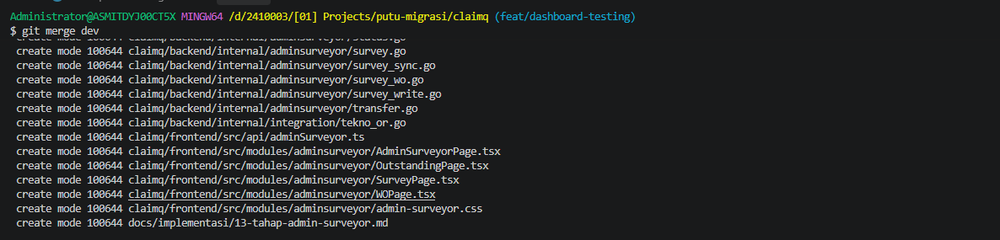
Setelah berhasil, kita perlu memastikan juga bahwa merge kita ini berjalan dengan baik dengan cara menjalankan <a href="#cara-menjalankan-aplikasi"> aplikasi kita</a>. Dicek apakah semua fitur berjalan dengan baik(silahkan komunikasikan dengan tim, tanyakan apakah fiturnya ada yang hilang atau tidak). Jika sudah, silahkan di push hasil merge tadi di branch backup(karna tadi kita memang sudah pindah ke branch backup). 
<li>

> **⚠️ Penting:** Langkah ini wajib dilakukan oleh **PIC MERGE REPOSITORY masing masing tim**


Setelah berhasil, langkah terakhir adalah kita pindah ke branch utama, lalu merge branch backup tadi ke branch utama(harap <code>git pull origin terlebih dahulu</code> agar memastikan tidak ada file yang baru setelah kita melakukan merge ke branch backup tadi. Jika setelah git pull origin ternyata ada file baru, perlu ditanyakan kepada tim kenapa ada file baru setelah proses merge kita tadi :) ).</li>
</ol>

Kembali ke [daftar isi](#daftar-isi)

#### **Cara push kerjaan kita dari local ke branch kita di repository**
<ol>
<li>Anggap kita sudah melakukan penambahan satu fitur, kita coba cek dengan command <pre><code>git status</code></pre></li>

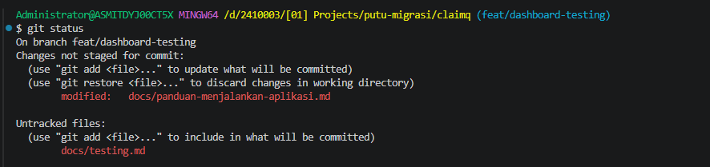
Nama file yang muncul, adalah file yang berubah, ditambahkan, dihapus, apapun itu. Langkah selanjutnya yang diperlukan adalah, kita jalankan command <pre><code>git add .</code></pre> Simplenya, git add . ini ngasih tau ke si git kalo semua perubahan yang ada di local ini, mau kita push ke repo kita.
<li>Setelah add, kita perlu menjalankan command <pre><code>git commit -m "ini diisi dengan pesan yang mau kita kirim, kayak apa yang kita perbuat, apa yang kita tambahkan, dll."</code></pre>

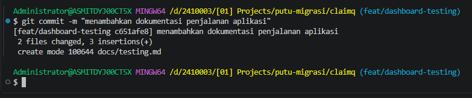

<li>Setelah sudah kita commit, mari kita push dengan command <pre><code>git push</code></pre></li>

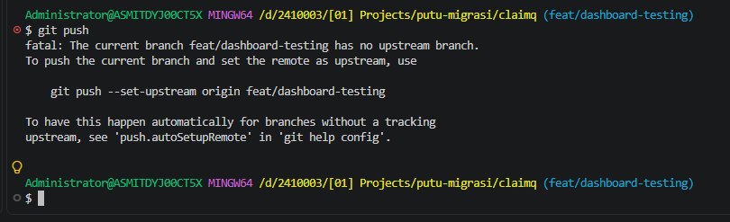

Namun, untuk push pertama kali pada branch baru yang kita buat, kita perlu menjalankan command <pre><code>git push --set-upstream origin <code>nama-branch-kita</code></code></pre>

Setelah berhasil, maka akan muncul tampilan seperti ini:

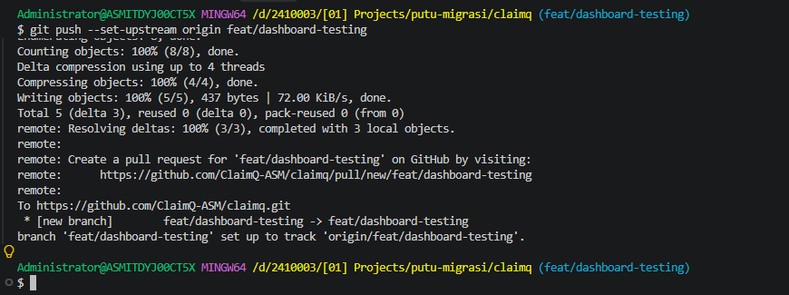
Next nya, karna kita udah pernah push, maka kita hanya perlu melakukan command <pre><code>git push</code></pre> setiap kita ingin push kerjaan kita ke branch kita di repository.
</li>
</ol>

Kembali ke [daftar isi](#daftar-isi)

#### **Cara membuka terminal baru**
<ol>
<li>Klik launch profile disini</li>

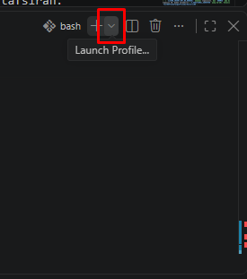

<li>Klik git bash</li>

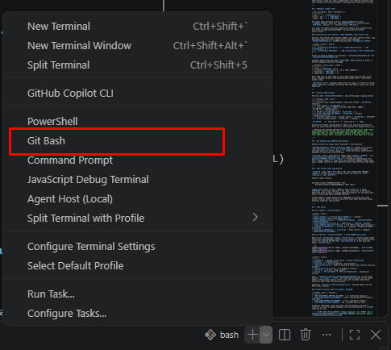

Setelah sukses membuat terminal git-bash baru, maka akan muncul tampilan seperti dibawah.

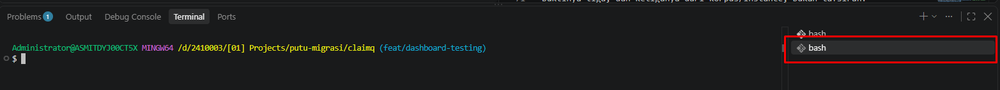
</ol>

Kembali ke [daftar isi](#daftar-isi)

#### **Cara membuka directory**
<ol>
<li>Ketikkan <code>cd nama-directory</code><pre><code>cd nama-directory</code></pre>. Untuk case ini, contohnya adalah membuka folder Bengkel di directory claimq. Maka, command yang diketikkan adalah <pre><code>cd Bengkel</code></pre></li>

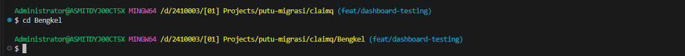
</ol>

Kembali ke [daftar isi](#daftar-isi)

#### **Cara matikan paksa terminal backend**

<ol>
<li> Kita check dulu apa aja yang sedang berjalan di terminal kita
<pre><code>netstat -ano | grep LISTENING | grep -E ":(8080|5173)"</code></pre>

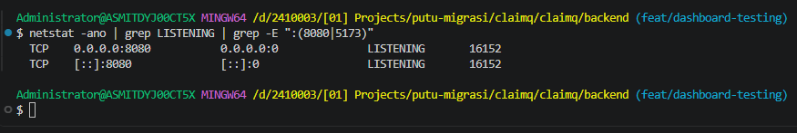 maka akan muncul list port yang sedang berjalan
</li>
<li>Matikan port yang sedang berjalan dengan command <pre><code>taskkill //PID <nomor-pid> //F</code></pre>
<code>//PID</code> diganti dengan kode disamping LISTENING

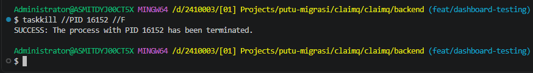
Setelah command berjalan, maka akan muncul pesan <code>SUCCESS: The process with PID 16152 has been terminated.</code>
</li>
</ol>

Kembali ke [daftar isi](#daftar-isi)

#### **Kesimpulan**

<ol>
<li>Pembuatan branch backup setiap merging itu hanyalah pencegahan, jika sudah pede bahwa conflict ketika merge tidak banyak(setiap merge pasti ada conflict ya), silahkan gas untuk merge dari branch utama ke branch masing2 fitur ya.</li>
</ol>
