# Panduan Git

## Perjanjian Baru

### Daftar Isi

- [Panduan Git](#panduan-git)
  - [Perjanjian Baru](#perjanjian-baru)
    - [Daftar Isi](#daftar-isi)
    - [Repository](#repository)
    - [Cara clone repository](#cara-clone-repository)
    - [Branch](#branch)
    - [Cara membuat branch baru](#cara-membuat-branch-baru)
    - [Cara menjalankan aplikasi](#cara-menjalankan-aplikasi)
      - [Menjalankan Back End](#menjalankan-back-end)
      - [Menjalankan Front End](#menjalankan-front-end)
    - [Cara merge branch](#cara-merge-branch)
    - [Cara merge kerjaan kita ke branch utama](#cara-merge-kerjaan-kita-ke-branch-utama)
    - [Cara merge kerjaan ke branch utama v2](#cara-merge-kerjaan-ke-branch-utama-v2)
    - [Cara push kerjaan kita dari local ke branch kita di repository](#cara-push-kerjaan-kita-dari-local-ke-branch-kita-di-repository)
    - [Cara membuka terminal baru](#cara-membuka-terminal-baru)
    - [Cara membuka directory](#cara-membuka-directory)
    - [Cara matikan paksa terminal backend](#cara-matikan-paksa-terminal-backend)
    - [Kesimpulan](#kesimpulan)

---

### Repository

Merupakan tempat kita simpan kerjaan kita secara online. Repository ini (biasa disingkat repo) dapat dikerjakan secara bersamaan oleh banyak developer, tapi kalau kita kerjakan semuanya di tempat yang sama, bakalan tabrakan. Maka dari itu, ada sebuah fitur yang bernama **branch**.

Namun, sebelum kita mulai mengerjakan, mari kita clone dulu repository yang sudah dibuat ke PC kita masing-masing. Lalu, bagaimana [cara clone repository](#cara-clone-repository)?

[Kembali ke daftar isi](#daftar-isi)

---

### Cara clone repository

Simple aja, buat directory di mana kita ingin clone repository kita. **Jangan buat directory di local disk C, buat di local disk D.** Dari ClaimQ, rule penamaan folder tempat repository di-clone adalah:

```
[nama-developer]-migrasi

contoh: john-doe-migrasi
```

Lalu, kita [buka directory](#cara-membuka-directory) tersebut dari `git bash` di aplikasi Visual Studio Code.

Setelah directory kita terbuka, jalankan command:

```bash
git clone <link repo git kita>
```

[Kembali ke daftar isi](#daftar-isi)

---

### Branch

Sebagai contoh, saya ambil case ClaimQ. Kami punya branch `dev`, di mana codingan utama disimpan. Dari branch `dev` inilah masing-masing developer membuat branch sendiri, yang meng-copy dari branch `dev`.

Misalnya developer A mendapat tugas mengerjakan fitur dashboard testing. Apa yang perlu dilakukan developer A?

1. Membuat branch baru dengan nama `feat/dashboard-testing`.

   Kenapa `feat/dashboard-testing`? Karena tim ClaimQ telah menyetujui rule penamaan branch ini. `feat` adalah singkatan dari *feature*. Nantinya akan ada rule penamaan lain, namun karena ini migrasi, kita anggap semuanya adalah fitur. Lihat [cara membuat branch baru](#cara-membuat-branch-baru).

2. Setelah developer A mengerjakan semua fiturnya, ia harus [push kerjaannya](#cara-push-kerjaan-kita-dari-local-ke-branch-kita-di-repository) ke branch dia sendiri.

3. Melakukan [merge dari branch utama](#cara-merge-kerjaan-kita-ke-branch-utama) (dalam case ini `dev`) ke branch dia sendiri. Untuk pencegahan error, disarankan membuat satu [branch backup](#cara-membuat-branch-baru).

4. Melakukan testing di branch backup-nya sendiri setelah melakukan merge dengan branch utama.

5. Setelah aman, developer A **wajib** menginfokan ke PIC merging agar branch backup dapat di-merge ke branch `dev` (branch utama dalam case ini).

[Kembali ke daftar isi](#daftar-isi)

---

### Cara membuat branch baru

Buka branch utama kita, di contoh ini branch `dev`. Maka, branch yang terbuka di terminal git bash kita adalah branch `dev`.

Pastikan kamu sudah berada di **directory yang benar**. Maksudnya apa? Coba buka repo di GitHub web-nya.

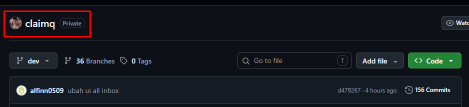

Yang ditandai merah adalah directory terluar kita. Lalu, cek directory yang terbuka di VS Code.

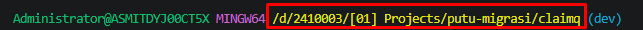

Jika directory yang kita buka sudah sama dengan directory terluar di repo GitHub web, berarti kita sudah berada di jalan yang benar.

Setelah berada di directory yang benar, pastikan juga kita berada di **branch yang benar**.

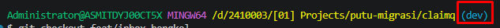

Yang ditandai merah adalah branch yang sedang dibuka. Di case ini branch yang terbuka adalah `dev`, dan branch baru memang ingin di-copy dari `dev` karena `dev` menjadi acuan utama.

Sekarang, ketikkan command berikut di terminal git bash:

```bash
git checkout -b feat/dashboard-testing
```

> Jangan lupa, rule penamaan branch harus disepakati di awal.

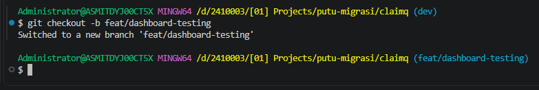

Setelah branch berhasil dibuat, akan muncul pesan seperti di atas, dan nama branch yang sedang dibuka sudah berubah. Selamat, kamu berhasil membuat branch baru!

Langkah selanjutnya, kita pelajari [cara menjalankan aplikasi](#cara-menjalankan-aplikasi) di PC masing-masing.

[Kembali ke daftar isi](#daftar-isi)

---

### Cara menjalankan aplikasi

Untuk menjalankan aplikasi, kita harus menjalankan [backend](#menjalankan-back-end) dan [frontend](#menjalankan-front-end).

#### Menjalankan Back End

1. [Buka terminal](#cara-membuka-terminal-baru) git bash baru di VS Code.

2. [Buka directory](#cara-membuka-directory) backend aplikasi kita. Directory backend tiap tim berbeda; di contoh ini, directory backend ClaimQ.

   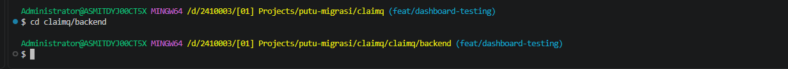

3. Setelah berhasil masuk directory, jalankan command:

   ```bash
   CLAIMQ_ENV=DEV go run ./cmd/claimq
   ```

4. Jika berhasil, akan muncul tampilan seperti ini:

   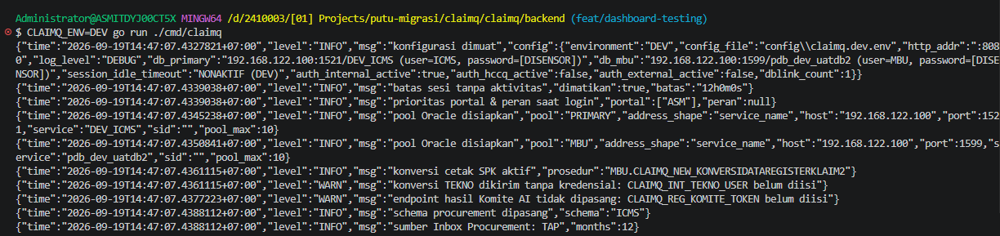

5. Jika muncul pesan bahwa ada port backend lain yang sedang berjalan, silakan [matikan paksa terminal backend](#cara-matikan-paksa-terminal-backend).

[Kembali ke daftar isi](#daftar-isi)

#### Menjalankan Front End

1. [Buka terminal](#cara-membuka-terminal-baru) git bash baru di VS Code.

2. [Buka directory](#cara-membuka-directory) frontend aplikasi kita. Directory frontend tiap tim berbeda; di contoh ini, directory frontend ClaimQ.

   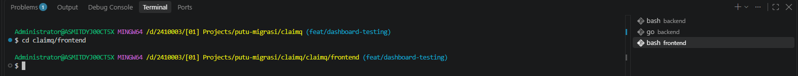

3. Saat pertama kali menjalankan frontend, install dependencies terlebih dahulu di directory frontend:

   ```bash
   npm install
   ```

   Jika berhasil, akan muncul tampilan seperti ini:

   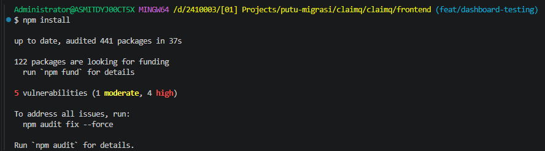

   > `npm install` hanya perlu dijalankan saat awal clone, dan jika ada dependencies baru yang ditambahkan ke aplikasi.

4. Setelah berhasil install, jalankan:

   ```bash
   npm run dev
   ```

   Jika sukses, akan muncul tampilan seperti ini:

   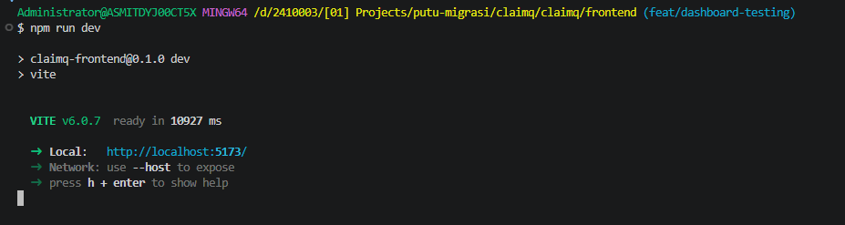

   Link local yang muncul di terminal adalah link frontend aplikasi di PC kita.

   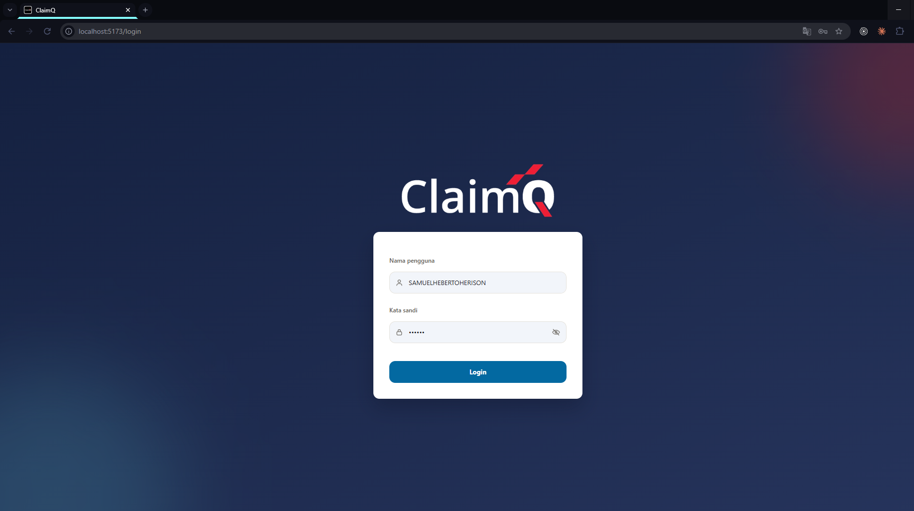

[Kembali ke daftar isi](#daftar-isi)

---

### Cara merge branch

Cara menggabungkan kerjaan dari branch masing-masing ke branch utama (dalam contoh ini branch `dev`):

1. Pastikan kerjaan kita sudah di-[push](#cara-push-kerjaan-kita-dari-local-ke-branch-kita-di-repository) ke branch kita sendiri.
2. Lanjutkan ke [cara merge kerjaan kita ke branch utama](#cara-merge-kerjaan-kita-ke-branch-utama).

[Kembali ke daftar isi](#daftar-isi)

---

### Cara merge kerjaan kita ke branch utama

1. Pastikan kerjaan di local kita sudah [ter-push](#cara-push-kerjaan-kita-dari-local-ke-branch-kita-di-repository) dengan baik ke branch di repo.

2. Pindah ke branch utama (dalam case ini `dev`):

   ```bash
   git checkout [nama-branch-yang-dituju]
   ```

   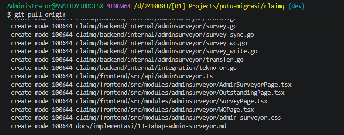

   Jika berhasil, nama branch yang muncul akan berubah sesuai branch yang dituju.

3. Ambil file terbaru dari branch utama di repo (siapa tahu sudah ada fitur baru):

   ```bash
   git pull origin
   ```

   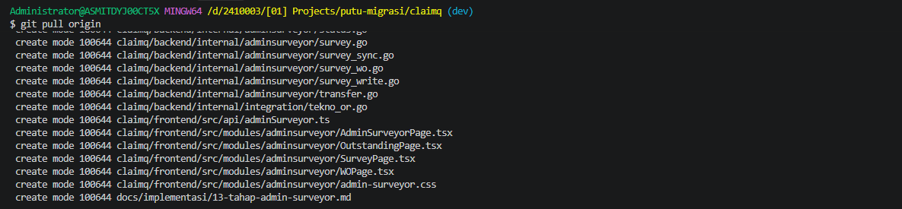

   Ini contoh kalau ada fitur baru di branch `dev`.

4. Pindah lagi ke branch fitur yang ingin kita gabungkan ke branch utama.

   Kenapa perlu bolak-balik? Ini murni pencegahan agar branch utama selalu aman dari error setelah merge. Caranya: gabungkan branch utama **ke** branch fitur kita (dalam hal ini `feat/dashboard-testing`), tapi lewat **branch backup** dulu.

   Nama branch backup biasanya ditambahkan `-backup` di belakang nama branch asli, contohnya `feat/dashboard-testing-backup`.

   > Branch backup **harus** di-copy dari branch fitur yang ingin digabungkan. Dalam case ini, `feat/dashboard-testing-backup` harus dibuat saat kita sedang membuka branch `feat/dashboard-testing`. Lihat [cara membuat branch baru](#cara-membuat-branch-baru).

5. Setelah branch backup dibuat, merge branch utama ke branch backup:

   ```bash
   git merge [nama-branch-utama]
   ```

   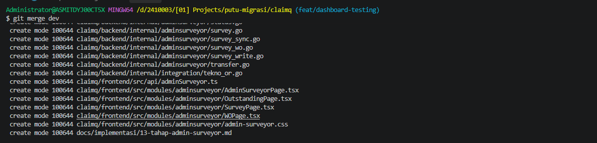

   Setelah berhasil, pastikan merge berjalan dengan baik dengan [menjalankan aplikasi](#cara-menjalankan-aplikasi). Cek apakah semua fitur berjalan dengan baik (komunikasikan dengan tim, tanyakan apakah ada fitur yang hilang). Jika sudah aman, push hasil merge di branch backup.

6. > **⚠️ Penting:** Langkah ini wajib dilakukan oleh **PIC MERGE REPOSITORY masing-masing tim**.

   Pindah ke branch utama, lalu merge branch backup tadi ke branch utama. Sebelumnya, jalankan `git pull origin` terlebih dahulu untuk memastikan tidak ada file baru setelah kita merge ke branch backup. Jika ternyata ada file baru, tanyakan ke tim kenapa ada file baru setelah proses merge tadi. :)

[Kembali ke daftar isi](#daftar-isi)

---

### Cara merge kerjaan ke branch utama v2

1. Kita pastikan kerjaan di branch fitur kita sudah di [push semua](#cara-push-kerjaan-kita-dari-local-ke-branch-kita-di-repository).
2. Setelah itu, kita langsung 
```bash
git pull origin <nama branch yang nantinya akan kita merge>
```
Contoh : 
```bash
git pull origin dev
```

Selesaikan conflict yang terjadi(jika ada), lalu jangan lupa di [push kembali](#cara-push-kerjaan-kita-dari-local-ke-branch-kita-di-repository).

3. Setelah conflict ter-selesaikan, silahkan di run-ulang [back end](#menjalankan-back-end) dan [front end](#menjalankan-front-end) nya, dan pastikan semua aplikasi telah berjalan dengan baik ya.
4. Jika sudah aman, mari kita buka repo kita di web, lalu klik tab pull request.

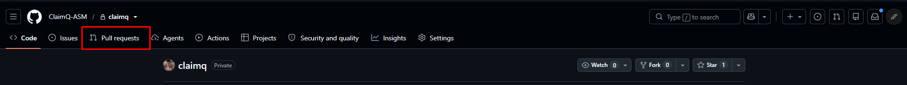

5. Klik new pull request(sebenarnya, kalau kita baru push kerjaan kita, biasanya git langsung nyaranin compare & pull request kok, cuman, biar lebih jelas, kita klik new pull request aja).

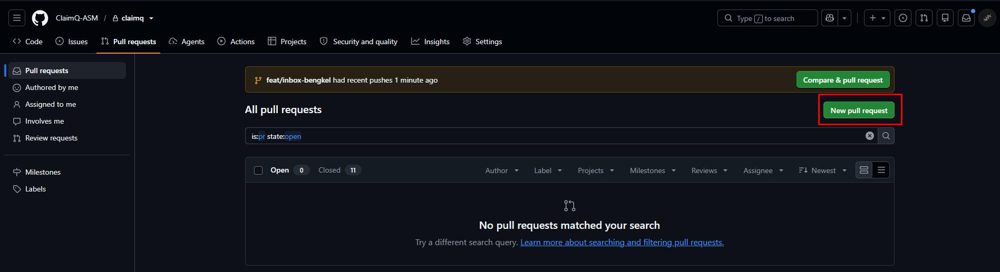

6. Pada 

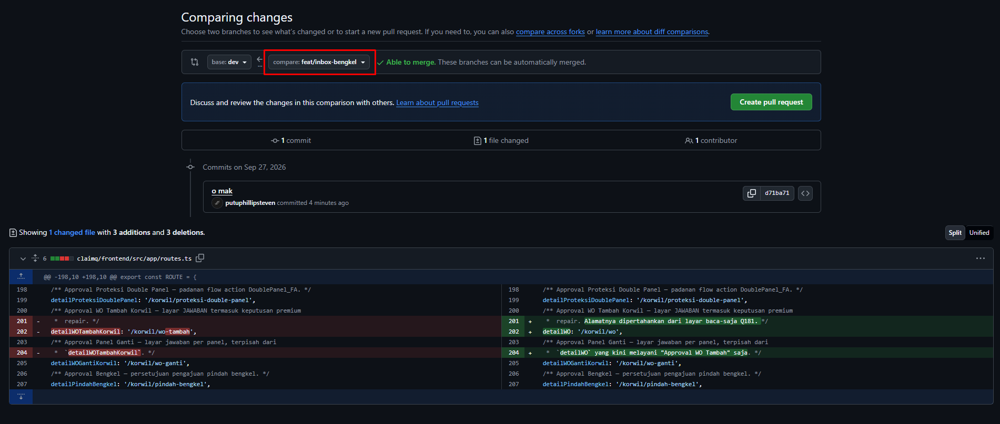


[Kembali ke daftar isi](#daftar-isi)

---

### Cara push kerjaan kita dari local ke branch kita di repository

1. Anggap kita sudah menambahkan satu fitur. Cek perubahannya dengan:

   ```bash
   git status
   ```

   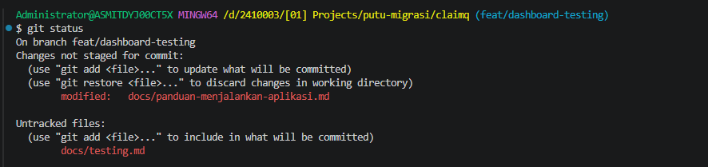

   Nama file yang muncul adalah file yang berubah, ditambahkan, atau dihapus. Selanjutnya jalankan:

   ```bash
   git add .
   ```

   Simpelnya, `git add .` memberi tahu git bahwa semua perubahan di local ini mau kita push ke repo.

2. Setelah `add`, jalankan commit:

   ```bash
   git commit -m "isi dengan pesan tentang apa yang kita kerjakan, tambahkan, dll."
   ```

   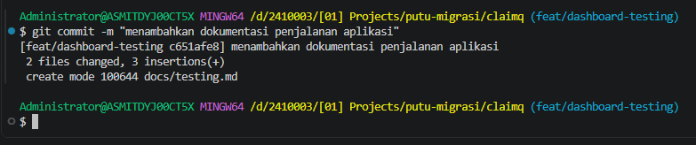

3. Setelah commit, push dengan:

   ```bash
   git push
   ```

   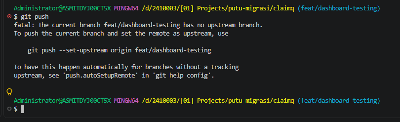

   Untuk push **pertama kali** di branch baru, jalankan:

   ```bash
   git push --set-upstream origin nama-branch-kita
   ```

   Jika berhasil, akan muncul tampilan seperti ini:

   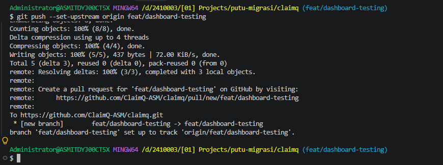

   Selanjutnya, karena sudah pernah push, cukup jalankan `git push` setiap kali ingin push kerjaan ke branch kita di repository.

[Kembali ke daftar isi](#daftar-isi)

---

### Cara membuka terminal baru

1. Klik launch profile di sini:

   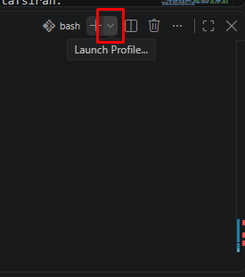

2. Klik **Git Bash**:

   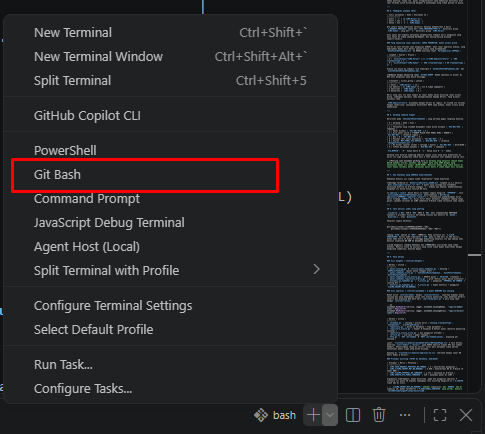

   Setelah terminal git bash baru berhasil dibuat, akan muncul tampilan seperti ini:

   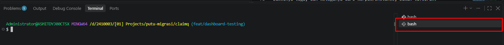

[Kembali ke daftar isi](#daftar-isi)

---

### Cara membuka directory

Ketikkan:

```bash
cd nama-directory
```

Sebagai contoh, untuk membuka folder `Bengkel` di directory ClaimQ:

```bash
cd Bengkel
```

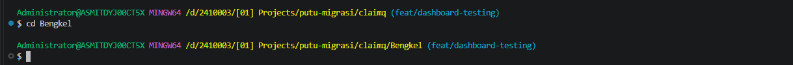

[Kembali ke daftar isi](#daftar-isi)

---

### Cara matikan paksa terminal backend

1. Cek dulu port apa saja yang sedang berjalan:

   ```bash
   netstat -ano | grep LISTENING | grep -E ":(8080|5173)"
   ```

   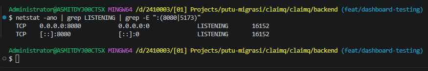

   Akan muncul daftar port yang sedang berjalan.

2. Matikan port tersebut dengan:

   ```bash
   taskkill //PID <nomor-pid> //F
   ```

   Ganti `<nomor-pid>` dengan angka di sebelah tulisan `LISTENING`.

   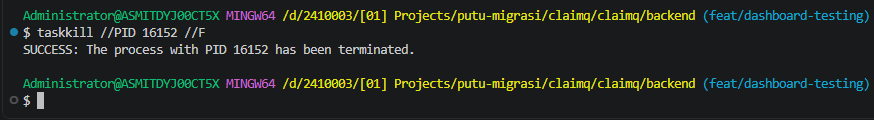

   Setelah command berjalan, akan muncul pesan seperti:

   ```
   SUCCESS: The process with PID 16152 has been terminated.
   ```

[Kembali ke daftar isi](#daftar-isi)

---

### Kesimpulan

1. Pembuatan branch backup setiap merging hanyalah pencegahan. Jika sudah yakin conflict saat merge tidak banyak (setiap merge pasti ada conflict), silakan langsung merge dari branch utama ke branch masing-masing fitur.

2. Proses merge yang dijelaskan di sini masih butuh banyak penyempurnaan. Nantinya akan ada tahap di mana merge ke branch utama harus melalui **pull request** terlebih dahulu, yang akan dipelajari lebih dalam. Jika ada yang sudah tahu cara membuat pull request atau cara merge yang lebih simpel, silakan infokan. Boleh juga langsung buat branch baru, lalu infokan ke saya agar di-merge ke branch master. Terima kasih!